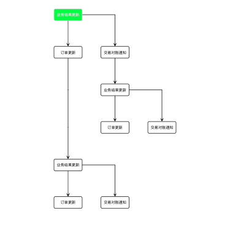

# btree-view

用于交易流程引擎flow 的 二叉树展示交互，根据json数据自动排版生成二叉树结构图


## install

```
npm install -S git+https://github.com/weivea/btree-view.git
```

## useage:

```javascript
import BTreeView from 'btree-view';
const _tr_color = Symbol('color');
const _tr_bg_color = Symbol('bgcolor');
interface Node {
  tradeNodeId: number;
  tradeNodeInstanceId: string;
  tradeNodeInstanceName: string;
  Necessary?: boolean;
  BelongToGroup?: string;
  failTradeNode?: Node;
  successTradeNode?: Node;
  [_tr_color]?: string;
  [_tr_bg_color]?: string;
}

let tree = new BTreeView<Node>({
  id: 'flow-view',
  colorKey: _tr_color,
  bgColorKey: _tr_bg_color,
});

tree.loadTree({
  tradeNodeId: 10000009,
  tradeNodeInstanceId: '4_10000009_1',
  tradeNodeInstanceName: '业务结果更新',
  Necessary: false,
  [_tr_bg_color]: '#0033ff',
  [_tr_color]: '#ddd',
  BelongToGroup: 'creditContract',
  failTradeNode: {
    tradeNodeId: 10000003,
    tradeNodeInstanceId: '4_10000003_24',
    tradeNodeInstanceName: '交易对账通知',
    Necessary: false,
    successTradeNode: {
      tradeNodeId: 10000009,
      tradeNodeInstanceId: '4_10000009_1',
      tradeNodeInstanceName: '业务结果更新',
      Necessary: false,
      BelongToGroup: 'creditContract',
      failTradeNode: {
        tradeNodeId: 10000003,
        tradeNodeInstanceId: '4_10000003_24',
        tradeNodeInstanceName: '交易对账通知',
        Necessary: false,
      },
      successTradeNode: {
        tradeNodeId: 32,
        tradeNodeInstanceId: '4_32_1',
        tradeNodeInstanceName: '订单更新',
        Necessary: true,
      },
    },
  },
  successTradeNode: {
    tradeNodeId: 32,
    tradeNodeInstanceId: '4_32_1',
    tradeNodeInstanceName: '订单更新',
    Necessary: true,
    successTradeNode: {
      tradeNodeId: 10000009,
      tradeNodeInstanceId: '4_10000009_1',
      tradeNodeInstanceName: '业务结果更新',
      Necessary: false,
      BelongToGroup: 'creditContract',
      failTradeNode: {
        tradeNodeId: 10000003,
        tradeNodeInstanceId: '4_10000003_24',
        tradeNodeInstanceName: '交易对账通知',
        Necessary: false,
      },
      successTradeNode: {
        tradeNodeId: 32,
        tradeNodeInstanceId: '4_32_1',
        tradeNodeInstanceName: '订单更新',
        Necessary: true,
      },
    },
  },
});


setTimeout(()=>{
  tree.loadTree({
    tradeNodeId: 10000009,
    tradeNodeInstanceId: '4_10000009_1',
    tradeNodeInstanceName: '业务结果更新',
    Necessary: false,
    [_tr_bg_color]: '#00ff33',
    [_tr_color]: '#ddd',
    BelongToGroup: 'creditContract',
    failTradeNode: {
      tradeNodeId: 10000003,
      tradeNodeInstanceId: '4_10000003_24',
      tradeNodeInstanceName: '交易对账通知',
      Necessary: false,
      successTradeNode: {
        tradeNodeId: 10000009,
        tradeNodeInstanceId: '4_10000009_1',
        tradeNodeInstanceName: '业务结果更新',
        Necessary: false,
        BelongToGroup: 'creditContract',
        failTradeNode: {
          tradeNodeId: 10000003,
          tradeNodeInstanceId: '4_10000003_24',
          tradeNodeInstanceName: '交易对账通知',
          Necessary: false,
        },
        successTradeNode: {
          tradeNodeId: 32,
          tradeNodeInstanceId: '4_32_1',
          tradeNodeInstanceName: '订单更新',
          Necessary: true,
        },
      },
    },
    successTradeNode: {
      tradeNodeId: 32,
      tradeNodeInstanceId: '4_32_1',
      tradeNodeInstanceName: '订单更新',
      Necessary: true,
      successTradeNode: {
        tradeNodeId: 10000009,
        tradeNodeInstanceId: '4_10000009_1',
        tradeNodeInstanceName: '业务结果更新',
        Necessary: false,
        BelongToGroup: 'creditContract',
        failTradeNode: {
          tradeNodeId: 10000003,
          tradeNodeInstanceId: '4_10000003_24',
          tradeNodeInstanceName: '交易对账通知',
          Necessary: false,
        },
        successTradeNode: {
          tradeNodeId: 32,
          tradeNodeInstanceId: '4_32_1',
          tradeNodeInstanceName: '订单更新',
          Necessary: true,
        },
      },
    },
  });
},3000)
tree.onNodeClict((node: Node) => {
  console.log(node);
});


// 对象清理
// tree.destroyed();


(window as any).tree = tree;


```

